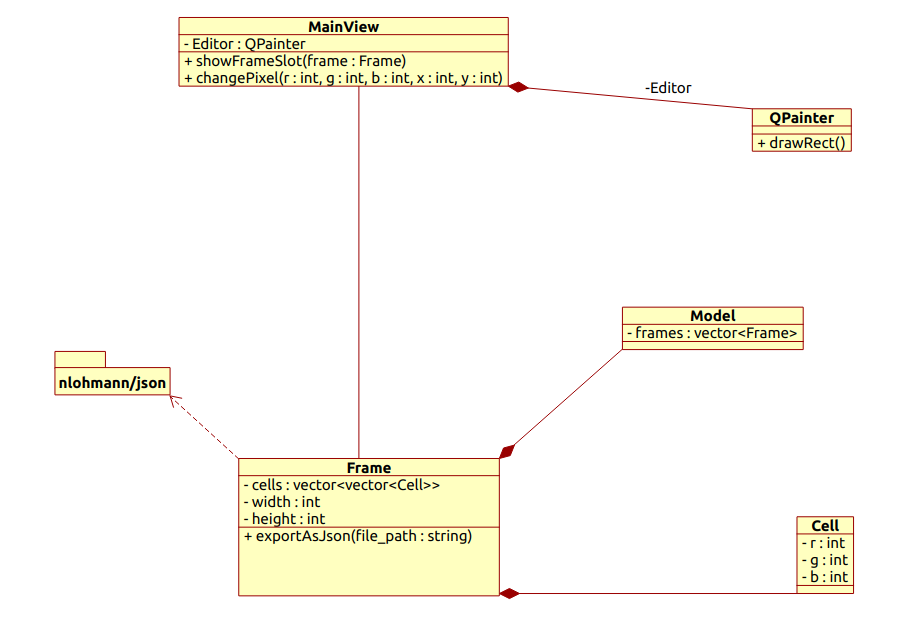

### Implementation details:
**Model classes/enums:**
1. A Frame class that holds a 2d vec of cells
    * frame class should have a draw function that paints a pixel a certain color.
    * frame class should also have a mirror function, etc
    * frame class should be de/serializable to json

2. A cell class that holds rgba values

3. a Tool enum that will hold the tool that has been selected

**Model slots**:
change tool
apply mirror
apply onionskin
mouse down handling
frame added
frame removed
export clicked
import clicked

**Model signals:**:
filesystem error encountered

**View classes:**
1. Dialog box
2. main Window

**View signals**:
all button clicks
mouse down
mouse location changed

**View slots**:
recieve updated frame (any time the model is changed, this signal should be emited)
display message
